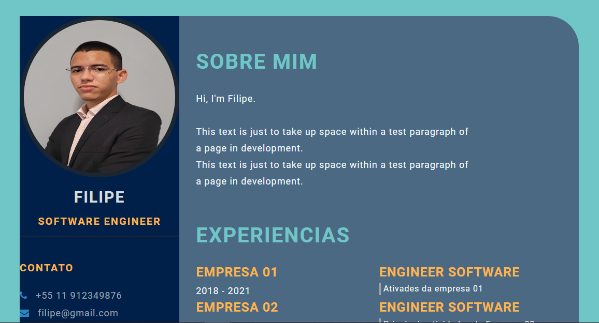

# devwek.ebac.git.github.io
🇧🇷 Brasil

Projeto de currículo da jornada dev da Ebac.  

Nesse projeto os participantes aprenderam a utilizar o Git e o GitHub e seus comandos básicos.

O objetivo era criar um currículo ficticio para aprender a manipular os principios básicos do CSS3 e HTML5.

🇺🇲 English

Ebac's dev journey curriculum project.

In this project the participants learned to use Git and GitHub and their basic commands.

The goal was to create a fictional curriculum to learn how to manipulate the basics of CSS3 and HTML5.

## Imagem de exemplo
